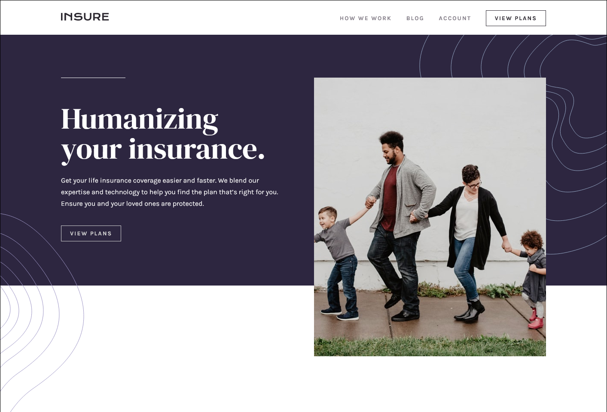

# Insure landing page solution

This is a solution to the [Insure landing page challenge on Frontend Mentor](https://www.frontendmentor.io/challenges/insure-landing-page-uTU68JV8). Frontend Mentor challenges help you improve your coding skills by building realistic projects. 

## Table of contents

- [Overview](#overview)
  - [The challenge](#the-challenge)
  - [Screenshot](#screenshot)
  - [Links](#links)
- [My process](#my-process)
  - [Built with](#built-with)
  - [What I learned](#what-i-learned)
- [Author](#author)

## Overview

### The challenge

Users should be able to:

- View the optimal layout for the site depending on their device's screen size
- See hover states for all interactive elements on the page

### Screenshot

### Links

- Solution URL: [Add solution URL here](https://github.com/DanRHatfield/FEM_Insure_Landing_Page)
- Live Site URL: [Add live site URL here](https://danrhatfield.github.io/FEM_Insure_Landing_Page/)

## My process

### Built with

- Semantic HTML5 markup
- CSS custom properties
- JavaScript for the mobile version hamburger menu

### What I learned

This was a fun project.  I learned about linear-gradient and how to use it to set two colors without any blending.  This allowed me to have the impression that the family photo went below the initial colored section.  I also become more familiar with multiple background images and how to layer them.

## Author

- Portfolio - [Dan Hatfield](https://danrhatfield.netlify.app/)
- LinkedIn - [DanRHatfield](https://www.linkedin.com/in/danrhatfield/)
- Frontend Mentor - [@DanRHatfield](https://www.frontendmentor.io/profile/DanRHatfield)
- GitHub - [DanRHatfield](https://github.com/DanRHatfield)
- Twitter - [@DanRHatfield](https://twitter.com/DanRHatfield)
